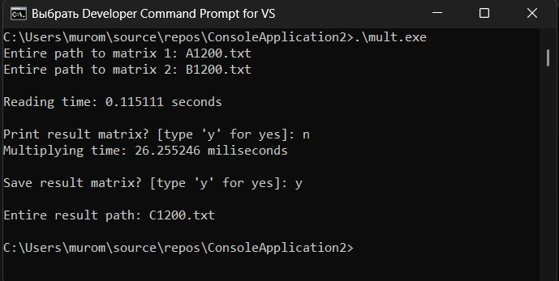
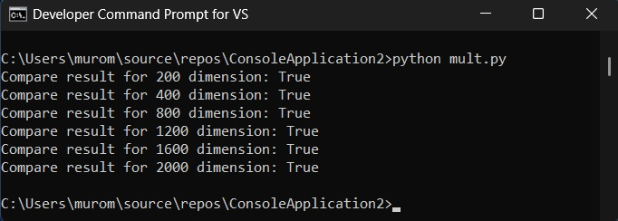
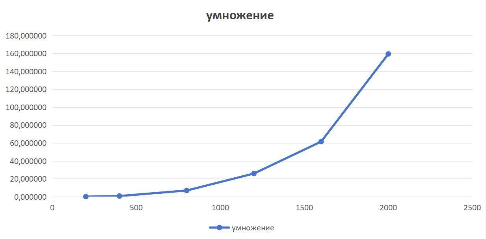

# Лабораторная работа №1: Последовательное перемножение квадратных матриц

## Автор

- **Студент:** Дубровин И.В.
  
- **Группа:** 6311
  
---
  

## Цель работы

Разработать программу на языке C++ для последовательного перемножения квадратных матриц, верефицировать программу при помощи программы на python.
провести замеры времени с различными матрицами больших размеров.

---

## Реализация

### Подготовка

Для задачи нам понадобится: тип для хранения матрицы, алгоритм считывания матрицы из файла, алгоритм перемножения матриц.

Так как у нас простые целые числа, для хранения матриц будем использовать двумерный вектор:

```cpp
typedef vector<vector<int>> Matrix;
```

#### Считываеие матрицы из файла

Генератор разделяет элементы матриц по пробелам, а строки переносами строк \n (\r\n в бинарном формате), поэтому удобно будет считать весь файл в одну строку и при помощи функции ***strtok_s*** разделять её на необходимые части:

```cpp
Matrix read_matrix(const char* path) {
    Matrix matr;
    FILE* f;
    char* text;
    char* line, * line_ctx = NULL;
    char* num, * num_ctx = NULL;

    fopen_s(&f, path, "rb");
    if (!f) return matr;

    text = read_file(f);
    fclose(f);

    line = strtok_s(text, "\r\n", &line_ctx);
    while (line) {
        num = strtok_s(line, " ", &num_ctx);
        matr.push_back(vector<int>());
        while (num) {
            matr[matr.size() - 1].push_back(to_int(num));
            num = strtok_s(NULL, " ", &num_ctx);
        }
        line = strtok_s(NULL, "\r\n", &line_ctx);
    }
    delete[] text;

    return matr;
}
```

### Перемножение

Используем стандартный цикл **i-k-j**.

Так как заранее известно, что матрицы квадратны, можем заранее узнать размерность, а значит не надо лишний раз вызывать **.size()** и заранее можем выделять память для **vector**:

```cpp
Matrix multiply(Matrix& matr1, Matrix& matr2) {
    size_t dim = matr1.size();
    Matrix rez(dim);

    for (size_t i = 0; i < dim; ++i) {
        rez[i] = vector<int>(dim);

        for (size_t j = 0; j < dim; ++j) {
            rez[i][j] = 0;
            for (size_t k = 0; k < dim; ++k) {
                rez[i][j] += matr1[i][k] * matr2[k][j];
            }
        }
    }

    return rez;
}
```

#### Замеры времени

Замеры времени производим при помощи библиотеки ***chrono***:

```cpp
--------------
auto start = chrono::steady_clock::now();
--------------
auto end = chrono::steady_clock::now();
--------------
chrono::duration<double>(end - start).count();
```

Результат возвращает прошедшие секунды в виде ***double***. Будем замерять время чтения матриц и время перемножения.

#### Результат

После перемножения из-за экспериментов с большими для вывода размерами, будем опционально предлагать вывести поученную матрицу на печать. Эту же схему сделаем и для сохранения матрицы в файл, чтобы большие матрицы можно было сохранить а не смотреть в консоли.

```cpp
    start = chrono::steady_clock::now();

    Matrix rez = multiply(matr1, matr2);

    end = chrono::steady_clock::now();


    getchar(); // '\n' rest in buffer

    printf("Print result matrix? [type 'y' for yes]: ");

    if (getchar() == 'y') {
        printf("\nResult:\n");
        print_matrix(rez);
        printf("\n");
    }
    printf("\Multiplying time: %lf miliseconds\n\n", chrono::duration<double>(end - start).count());

    getchar(); // '\n' rest in buffer
    printf("Save result matrix? [type 'y' for yes]: ");

    if (getchar() == 'y') {
        printf("\nEntire result path: ");
        scanf_s("%s", path1, 128);
        load_matrix(rez, path1);
    }
```

## Описание экспериментов

### Цель экспериментов

Определить зависимость времени считывания и умножения матриц от их размера.

### Параметры экспериментов

- **Размеры матриц:** 200, 400, 800, 1200, 1600, 2000
- **Тип данных:** int от 0 до 10
- **Количество экспериментов:** 6
- **Измеряемые параметры:** Время считывания, время перемножения (секунды)

### Методика

1. Для каждого размера n генерируются две случайные матрицы A и B размером n×n
  
2. Матрицы сохраняются в файлы
  
3. Выполняется умножение матриц A × B с замерами времени
  
4. Результат сохраняется в файл вида C**n**.txt
  
  ## Результаты
  

### Пример вывода приложения



Верификация результата

Дабы результат был достоверен и независим от нас, будем пользоваться библиотекой предназначеной для работы с матрицами ***numpy***:

```python
import numpy as np

for dim in [200, 400, 800, 1200, 1600, 2000]:
    with open(f'A{dim}.txt', 'r') as matrix:
        matr1 = np.matrix([list(map(int, x.split(' '))) for x in matrix.readlines()])

    with open(f'B{dim}.txt', 'r') as matrix:
        matr2 = np.matrix([list(map(int, x.split(' '))) for x in matrix.readlines()])

    matr_rez = matr1 * matr2

    with open(f'C{dim}.txt', 'r') as matrix:
        matr3 = np.matrix([list(map(int, x.split(' '))) for x in matrix.readlines()])

    print(f'Compare result for {dim} dimension:', np.array_equal(matr_rez, matr3))


```



Для всех матриц итог перремножение совпал.

### Результаты

|     | 200, сек | 400, сек | 800, сек | 1200, сек | 1600, сек | 2000, сек |
| --- | --- | --- | --- | --- | --- | --- |
| считывание | 0,007077 | 0,016194 | 0,061639 | 0,115111 | 0,216188 | 0,324720 |
| умножение | 0,097049 | 0,762922 | 6,930688 | 25,873432 | 61,504761 | 159,411537 |

### График на основе данных



## Анализ

Время выполнения растет пропорционально $ O(n^3)$:

$200 -> 400: 0,097 * 8 = 0,776 \approx 0,763$

$400 -> 800: 0,763 * 8 = 6,104 \approx 6,930$

$800 -> 1600: 6,930 * 8 = 55,44 \approx 61,504$

Видно, что фактически рост выше, что свзяно с ростом минорных операций вроде проверки условий циклов, выделение памяти и пр.

## Запуск

1. Откройте коммандную строку разработчика и Перейдите в директорию с **.cpp** файлом
2. Скомпилируйте программу командой ***cl mult.cpp***
3. Запустите через **.\mult.exe**
4. Запуск верификации происходит через команду **python mult.py**

## Выводы

В ходе лабораторной работы разработана программа на языке C++ для умножения квадратных матриц. Проведены эксперименты с матрицами размеров 200×200, 400×400, 800×800, 1200×1200, 1600×1600 и 2000×2000. Увидели тренд соответсвующий $O(n^3)$ по BigO нотации. Выполнена автоматизированная верификация результатов с помощью библиотеки NumPy на Python.
