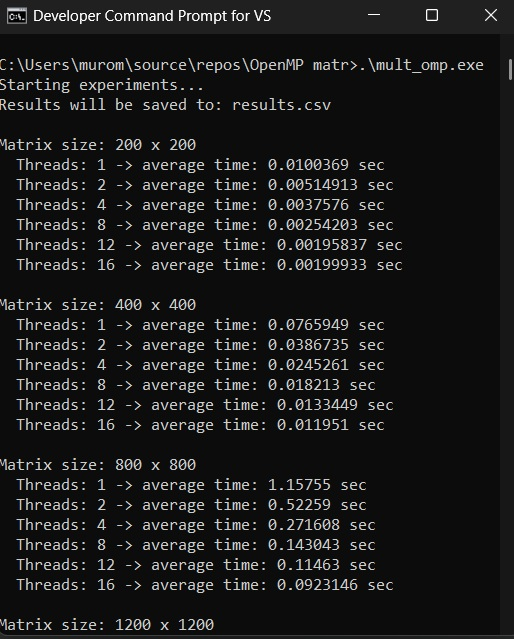
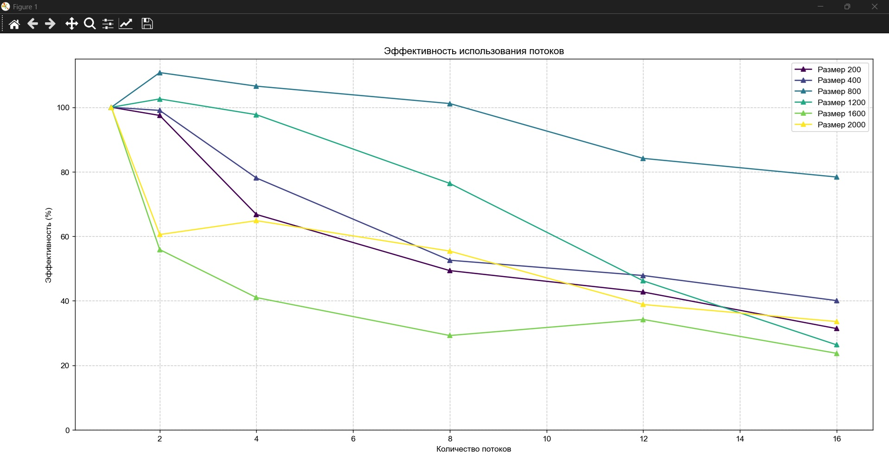
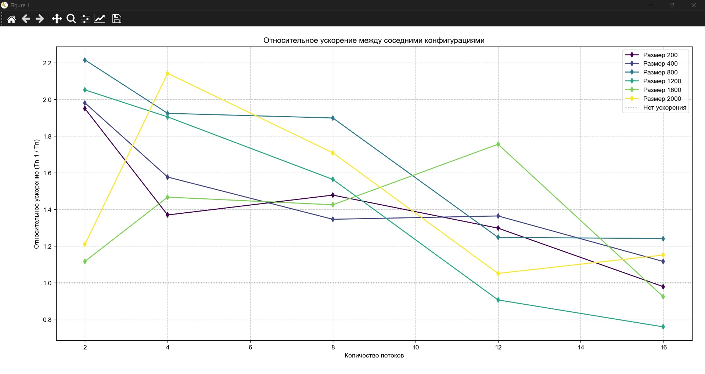

# Лабораторная работа №2: Перемножение квадратных матриц при помощи OpenMP

## Автор

- **Студент:** Дубровин И.В.
  
- **Группа:** 6311
  
---
  

## Цель работы

Модифицировать программу из Л/Р №1 для параллельного перемножения квадратных матриц при помощи OpenMP.
Провести замеры времени с различным кол-вом потоков, сделать выводы об эффективности.

---

## Реализация

### Подготовка

Так как требуется провести множество замеров с множеством потоков, делать одну программу и потом вручную запускать с разными данными нецелесообразно, поэтому реализуем и генерацию матриц и перебор их размеров прямо в модифицированной программе:

```cpp
Matrix generate_matrix(size_t dim) {
    Matrix matr(dim, vector<int>(dim));
    
    for (size_t i = 0; i < dim; ++i)
        for (size_t j = 0; j < dim; ++j)
            matr[i][j] = rand() % 11; // 0-10

    return matr;
}
```

Так как мы убедились в правильности алгоритма, нужны сорхранять и проверять корректность матриц не имеет смысла, поэтому всё что нас будет интересовать это только время, для надёжнсти будем мерить по среднему из трёх испытаний для каждого потока и размера. Все результаты сохраним в **.csv** файл.

```cpp
int main() {
    srand(time(NULL));

    vector<size_t> sizes = { 200, 400, 800, 1200, 1600, 2000 };
    vector<int> thread_counts = { 1, 2, 4, 8, 12, 16 };
    int repeats_per_test = 3;
    string output_file = "results.csv";

    // Create CSV header
    ofstream out(output_file);
    out << "size,threads,time_sec\n";
    out.close();

    cout << "Starting...\n";

    for (size_t size : sizes) {
        cout << "Matrix size: " << size << " x " << size << endl;

        // Generate two matrices once per size
        Matrix A = generate_matrix(size);
        Matrix B = generate_matrix(size);

        for (int threads : thread_counts) {
            double avg_time = measure_time(A, B, threads, repeats_per_test);
            cout << "  Threads: " << threads << " -> average time: " << avg_time << " sec" << endl;
            save_result(output_file, size, threads, avg_time);
        }
        cout << endl;
    }

    cout << "End. Results saved in " << output_file << endl;
    return 0;
}
```

#### Реализация OpenMP

```cpp
Matrix multiply_parallel(const Matrix& matr1, const Matrix& matr2, int num_threads) {
    size_t dim = matr1.size();
    Matrix rez(dim, vector<int>(dim, 0));

    omp_set_num_threads(num_threads);

#pragma omp parallel for schedule(static)
    for (int i = 0; i < (int)dim; ++i) {
        for (size_t j = 0; j < dim; ++j) {
            int sum = 0;
            for (size_t k = 0; k < dim; ++k) {
                sum += matr1[i][k] * matr2[k][j];
            }
            rez[i][j] = sum;
        }
    }
    return rez;
}
```

```cpp
omp_set_num_threads(num_threads);
```

задаёт кол-во потоков.

```cpp
#pragma omp parallel for schedule(static)
```

Говворит, что последующий цикл будет выполняться параллельно, причём блоками примерно равного размера.

Дополнительно замечу, что вместо прямого суммирования элементов матрицы, мы сначала создаём переменную **int sum = 0**, а потом присваиваем элементу.

Это сделано, чтобы избежать конфликта к кеш линии, если бы разные потоки работали с матрице напрямую, то могла бы произойти блокировка кеш-линии и поток могли наткнуться на блокировку т.к матрица - общий ресурс.

## Запуск

программу скомпилируем со специальными флагами для MSVC

**cl /O2 /openmp MP_mult.cpp /Fe:mult_omp.exe**

(/O2 означает максимальноную оптимизацию)



## Результаты

| size | threads | time_sec |
| --- | --- | --- |
| 200 | 1   | 0.010037 |
| 200 | 2   | 0.005149 |
| 200 | 4   | 0.003758 |
| 200 | 8   | 0.002542 |
| 200 | 12  | 0.001958 |
| 200 | 16  | 0.001999 |

| size | threads | time_sec |
| --- | --- | --- |
| 400 | 1   | 0.076595 |
| 400 | 2   | 0.038673 |
| 400 | 4   | 0.024526 |
| 400 | 8   | 0.018213 |
| 400 | 12  | 0.013345 |
| 400 | 16  | 0.011951 |

| size | threads | time_sec |
| --- | --- | --- |
| 800 | 1   | 1.157549 |
| 800 | 2   | 0.522590 |
| 800 | 4   | 0.271608 |
| 800 | 8   | 0.143043 |
| 800 | 12  | 0.114630 |
| 800 | 16  | 0.092315 |

| size | threads | time_sec |
| --- | --- | --- |
| 1200 | 1   | 3.550705 |
| 1200 | 2   | 1.730590 |
| 1200 | 4   | 0.908568 |
| 1200 | 8   | 0.580998 |
| 1200 | 12  | 0.640596 |
| 1200 | 16  | 0.842652 |

| size | threads | time_sec |
| --- | --- | --- |
| 1600 | 1   | 10.751343 |
| 1600 | 2   | 9.620244 |
| 1600 | 4   | 6.556454 |
| 1600 | 8   | 4.598622 |
| 1600 | 12  | 2.619455 |
| 1600 | 16  | 2.833726 |

| size | threads | time_sec |
| --- | --- | --- |
| 2000 | 1   | 52.339935 |
| 2000 | 2   | 43.234836 |
| 2000 | 4   | 20.181484 |
| 2000 | 8   | 11.808523 |
| 2000 | 12  | 11.228790 |
| 2000 | 16  | 9.747476 |

### Графики результатов

Мучилься с их составление в экселе не хочется, поэтому на помощь приходит **python**:

```python
import pandas as pd
import matplotlib.pyplot as plt
import numpy as np

plt.rcParams['font.sans-serif'] = ['Arial']
plt.rcParams['axes.unicode_minus'] = False

# Чтение данных
df = pd.read_csv('results.csv')
sizes = sorted(df['size'].unique())
threads = sorted(df['threads'].unique())
colors = plt.cm.viridis(np.linspace(0, 1, len(sizes)))

# ------------------------------------------------------------
# 1. Время выполнения
# ------------------------------------------------------------
plt.figure(figsize=(8, 6))
for idx, size in enumerate(sizes):
    sub = df[df['size'] == size].sort_values('threads')
    plt.plot(sub['threads'], sub['time_sec'], 'o-', label=f'Размер {size}', color=colors[idx])

plt.xlabel('Количество потоков')
plt.ylabel('Время (секунды)')
plt.title('Время выполнения умножения матриц')
plt.grid(True, linestyle='--', alpha=0.7)
plt.legend()
plt.tight_layout()
plt.show()

# ------------------------------------------------------------
# 2. Абсолютное ускорение (относительно 1 потока)
# ------------------------------------------------------------
plt.figure(figsize=(8, 6))
for idx, size in enumerate(sizes):
    sub = df[df['size'] == size].sort_values('threads')
    t1 = sub[sub['threads'] == 1]['time_sec'].values[0]
    speedup = t1 / sub['time_sec'].values
    plt.plot(sub['threads'], speedup, 's-', label=f'Размер {size}', color=colors[idx])

# Идеальное ускорение
max_thread = max(threads)
plt.plot([1, max_thread], [1, max_thread], 'k--', label='Идеальное ускорение', alpha=0.7)
plt.xlabel('Количество потоков')
plt.ylabel('Ускорение (T1 / Tn)')
plt.title('Абсолютное ускорение')
plt.grid(True, linestyle='--', alpha=0.7)
plt.legend()
plt.tight_layout()
plt.show()

# ------------------------------------------------------------
# 3. Эффективность
# ------------------------------------------------------------
plt.figure(figsize=(8, 6))
for idx, size in enumerate(sizes):
    sub = df[df['size'] == size].sort_values('threads')
    t1 = sub[sub['threads'] == 1]['time_sec'].values[0]
    speedup = t1 / sub['time_sec'].values
    efficiency = (speedup / sub['threads'].values) * 100
    plt.plot(sub['threads'], efficiency, '^-', label=f'Размер {size}', color=colors[idx])

plt.xlabel('Количество потоков')
plt.ylabel('Эффективность (%)')
plt.title('Эффективность использования потоков')
plt.ylim(0, 115)
plt.grid(True, linestyle='--', alpha=0.7)
plt.legend()
plt.tight_layout()
plt.show()

plt.figure(figsize=(8, 6))
for idx, size in enumerate(sizes):
    sub = df[df['size'] == size].sort_values('threads')
    times = sub['time_sec'].values
    # Вычисляем ускорение относительно предыдущего колва потоков
    rel_speedup = [1.0]

    for i in range(1, len(times)):
        rel_speedup.append(times[i-1] / times[i])

    plt.plot(sub['threads'][1:], rel_speedup[1:], 'd-', label=f'Размер {size}', color=colors[idx])

plt.axhline(y=1, color='gray', linestyle=':', alpha=0.7, label='Нет ускорения')
plt.xlabel('Количество потоков')
plt.ylabel('Относительное ускорение (Tn-1 / Tn)')
plt.title('Относительное ускорение между соседними конфигурациями')
plt.grid(True, linestyle='--', alpha=0.7)
plt.legend()
plt.tight_layout()
plt.show()

```






## Анализ

Распараллелевание кода даёт значительный прирост в скорости, однако больше потоков != больше эффективности. В некоторых случая видно, что увеличение числа потоков наоборот делает программу медленнее, т.е мало того, что результат ожидается дольше, так ещё и ресурсы процессора тратятся больше, что даёт двойной негативный эффект.

OpenMP невероятно прост в реализации, пара деректив позволяют ускорить вычисление огровных матриц в разы, даже при малом кол-ве потоков.

## Выводы

В ходе лабораторной работы модифицирована программа на языке C++ из Л/Р №1 для умножения квадратных матриц при помози OpenMP. Проведены эксперименты с матрицами размеров 200×200, 400×400, 800×800, 1200×1200, 1600×1600 и 2000×2000 с потоками 1, 2, 4, 8, 12, и 16. Результаты показали значительный прирост в производительности, однако кол-во потоков надо выбирать соразмерно задачи, излишнее кол-во ресурсов может только вредить.
