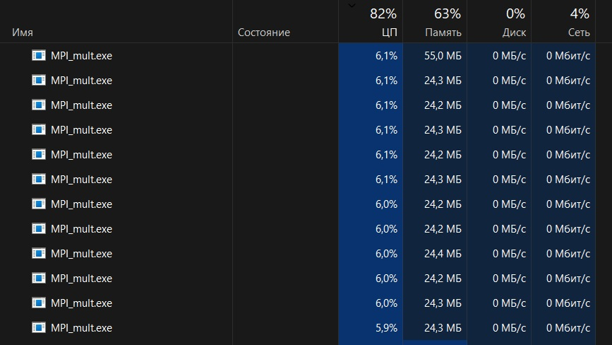

# Лабораторная работа №3: Перемножение квадратных матриц при помощи MPI

## Автор

- **Студент:** Дубровин И.В.
- **Группа:** 6311

---

## Цель работы

Модифицировать программу из Л/Р №1 для параллельного перемножения квадратных матриц с использованием технологии **MPI** (Message Passing Interface). Провести замеры времени с разным количеством процессов (1, 2, 4, 8, 12, 16) для матриц различных размеров, сделать выводы об эффективности параллелизации в модели передачи сообщений.

## Реализация

### Особенности MPI-версии

В отличие от OpenMP, где используется общая память, в MPI каждый процесс имеет собственную память и обменивается данными через сообщения. Поэтому матрица A распределяется между процессами по строкам (блоками), матрица B полностью рассылается всем процессам. Каждый процесс вычисляет свою часть результирующей матрицы, затем результаты собираются на главном процессе (ранг 0).
Как и в прошлой лабораторной, генерация матриц происходит в самой программе, и берётся среднее время по трём испытаниям для каждого размера. Результаты сохраняются в CSV-файл.

### Генерация матриц и проведение замеров

```cpp
int main() {
 const int sizes[] = {200, 400, 800, 1200, 1600, 2000};
 const int repeats = 3;
 const string csv_filename = "results_mpi.csv";

for (int idx = 0; idx < 6; ++idx) {
    int n = sizes[idx];
    if (rank == 0) {
        A.resize(n, vector<int>(n));
        B.resize(n, vector<int>(n));
        fillRandom(A);
        fillRandom(B);
    }
    double total_time = 0.0;
    for (int r = 0; r < repeats; ++r) {
        MPI_Barrier(MPI_COMM_WORLD);
        double start = MPI_Wtime();
        multiply_mpi(A, B, rank, size, n);
        MPI_Barrier(MPI_COMM_WORLD);
        double end = MPI_Wtime();
        total_time += (end - start);
    }
    double avg_time = total_time / repeats;
    if (rank == 0) {
        // запись в CSV
    }
}
```

}

### Параллельное умножение с MPI

Используем порядок циклов **i-k-j** для лучшей локальности кэша. Алгоритм:

1. Рассылка матрицы B через MPI_Bcast.
  
2. Распределение строк матрицы A с помощью MPI_Scatterv.
  
3. Каждый процесс C_local.
  
4. Сбор ка всех C_local через MPI_Gatherv.
  

```cpp
void multiply_mpi(const Matrix& A, const Matrix& B, int rank, int size, int n) {
 // 1. Рассылка B
 vector<int> B_flat(n*n);
 if (rank == 0) { /* упаковка B */ }
 MPI_Bcast(B_flat.data(), n*n, MPI_INT, 0, MPI_COMM_WORLD);

// 2. Распределение строк A
MPI_Scatterv(A_flat.data(), sendcounts.data(), displs.data(), MPI_INT,
             A_local_flat.data(), local_rows*n, MPI_INT, 0, MPI_COMM_WORLD);

// 3. Локальное умножение (i-k-j)
for (int i = 0; i < local_rows; ++i)
    for (int k = 0; k < n; ++k)
        for (int j = 0; j < n; ++j)
            C_local[i][j] += A_local[i][k] * B_mat[k][j];

// 4. Сбор результата
MPI_Gatherv(C_local_flat.data(), local_rows*n, MPI_INT,
            C_flat.data(), recvcounts_elem.data(), displs_elem.data(), MPI_INT,
            0, MPI_COMM_WORLD);
```

}

### Компиляция и запуск

Так как MS-MPI не предоставляет обёртки `mpicc`, компиляция выполняется вручную:

1. Запускаем **x64 Native Tools Command Prompt for VS** и идём в директорию с кодом.
  
2. Компилируем сначала объектный файл с указанием инклюда: **cl /I"C:\Program Files (x86)\Microsoft SDKs\MPI\Include" /c MPI_mult.cpp**
  
3. Линкуем объектный файл в MPI_mult.exe : **link /machine:x64 /out:MPI_mult.exe "msmpi.lib" /libpath:"C:\Program Files (x86)\Microsoft SDKs\MPI\Lib\x64" MPI_mult.obj**
  
4. Запускаем с разным количеством процессов:
  
  mpiexec -n 1 MPI_mult.exe
  mpiexec -n 2 MPI_mult.exe
  mpiexec -n 4 MPI_mult.exe
  mpiexec -n 8 MPI_mult.exe
  mpiexec -n 12 MPI_mult.exe
  mpiexec -n 16 MPI_mult.exe
  
  
  

---

## Результаты экспериментов

Полученные данные (время умножения в секундах):

| size | 1 proc | 2 proc | 4 proc | 8 proc | 12 proc | 16 proc |
| --- | --- | --- | --- | --- | --- | --- |
| 200 | 0.065690 | 0.032420 | 0.025830 | 0.013839 | 0.011444 | 0.010678 |
| 400 | 0.510156 | 0.255694 | 0.162921 | 0.098251 | 0.079803 | 0.077740 |
| 800 | 4.140454 | 2.271446 | 1.259085 | 0.760299 | 0.644640 | 0.572153 |
| 1200 | 14.420149 | 8.455832 | 5.558075 | 2.991302 | 2.262073 | 1.999831 |
| 1600 | 34.080055 | 19.890805 | 13.144096 | 6.849293 | 5.127966 | 4.566343 |
| 2000 | 66.045121 | 38.729886 | 20.609658 | 12.243282 | 10.152885 | 8.945910 |

### Графики

Для визуализации используем python-скрипт из прошлой лабы:


## Анализ

При увеличении числа процессов время умножения ожидаемо снижается. Наибольший выигрыш наблюдается при переходе от 1 к 2 процессам и от 4-х к 8-ми. При дальнейшем росте числа процессов ускорение растёт медленнее из-за накладных расходов на передачу сообщений, однако не наблюдается замедленний, как в случае с OpenMP. Сам MPI показал эффективность лучше чем у OpenMP, что неудивительно, ведь как было видно на скриншоте MPI загружал ЦП под завязку.

---

## Выводы

В ходе лабораторной работы реализовано параллельное умножение квадратных матриц с использованием MPI. Проведены эксперименты для матриц размеров от 200×200 до 2000×2000 с количеством процессов 1,2,4,8,12,16. Полученные результаты показывают, что MPI эффективен для крупных задач, где время вычислений значительно превышает время коммуникаций. При этом MPI-программа требует более тщательного проектирования распределения данных по сравнению с OpenMP, но даёт возможность масштабирования на кластерные системы.

Технология MPI успешно справляется с задачей, ускорение на 16 процессах для матрицы 2000×2000 составило ≈7.4 раза (при идеальном 16).
