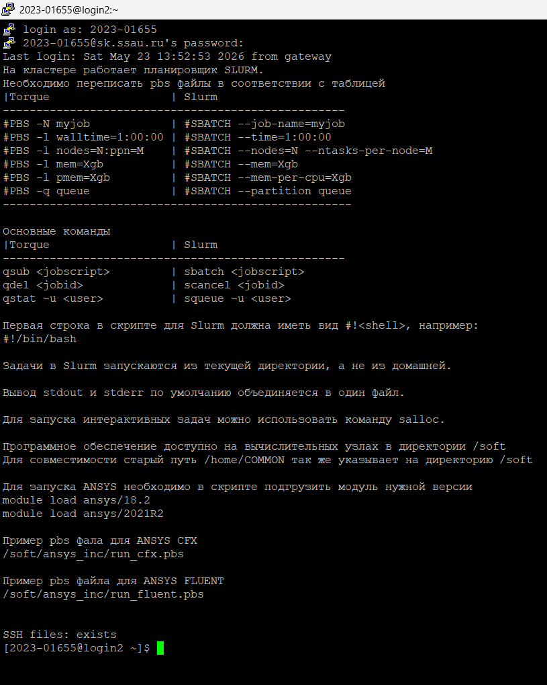
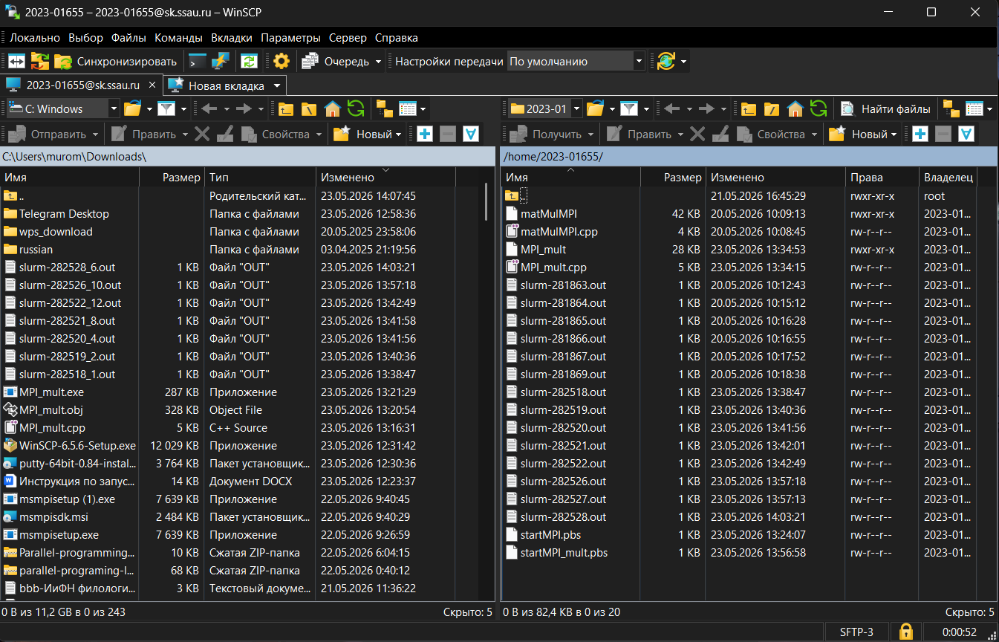
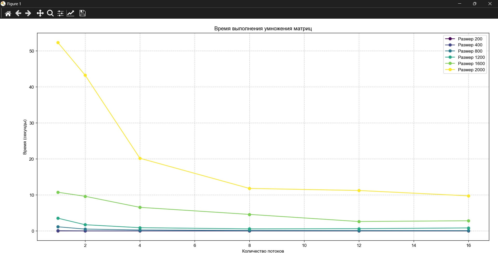
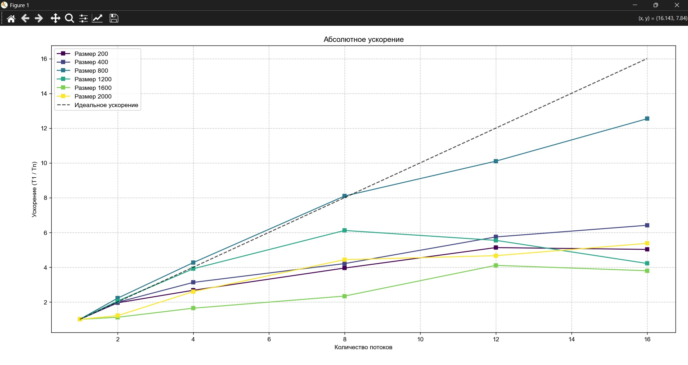
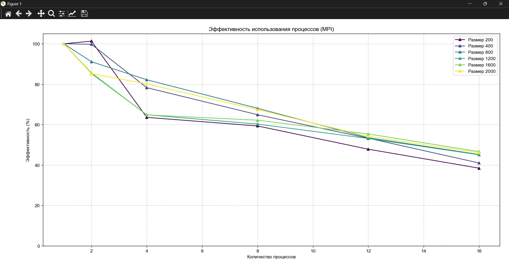
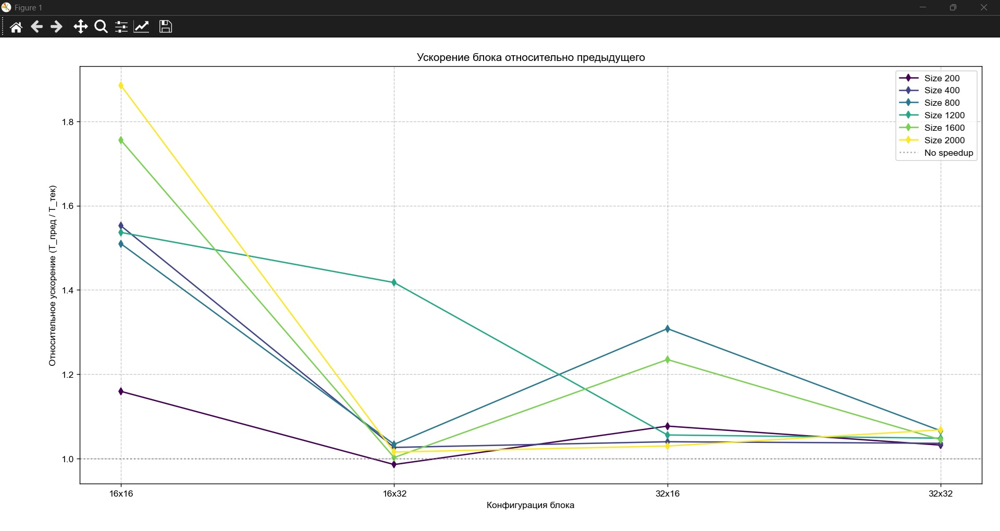

# Лабораторная работа №5: Перемножение квадратных матриц на суперкомпьютере

## Автор

- **Студент:** Дубровин И.В.
- **Группа:** 6311

---

## Цель работы

Познакомится с суперкомпьютером Сергей Королёв, подключиться к нему по SSH соединению и ознакомится с основыми работы. Модифицировать программу из Л/Р №3 (MPI) для запуска на суперкомпьютере.

---

## Подключение к суперкомпьютеру

Для подключения потребовалось скачать две программы: для SSH соединения - PuTTY и для обмена файлами winSCP. Попав в 18-й корпус и подключившись к интернету, имея ip самарского университета, можно было подключаться. Однако мой пароль не подходил (access denied), поэтому пришлось попросить данные моего одногруппника Михаила Рыжкова (2023-01655) и наконец подключиться.



## Особенности реализации

Суперкомпьютер Сергей королёв имеет операционную систему CentOS (дистрибутив линукса на базе Red Hat), но благо, мой код достаточно высокоуровневый чтобы его не менять, однако:

1. Компилятор жаловался, что нельзя писать "**>>**" в строке 
  ```cpp
  typedef vector<vector<int>> Matrix;
  ```
  пришлось исправить на "**> >**"
  
3. Также я решил вырезать сохранение в **.csv** файл. Сергей Королёв и так сохраняет в файл то что выводилось в процессе, поэтому данные сформирую вручную.
  

В остальном код идентичен коду из Л/Р №3

### Компиляция и запуск

Перед компиляцием включим модуль MPI:

> **module load intel/mpi4**

После этого можем компилировать:

> mpicxx -O2 MPI_mult.cpp -o ./MPI_mult

(Для скорости добавил ещё флаг -О2)

Теперь можем запускать файл при помощи **.pbs** файла (извините, забыл его сохранить), в котором указываем кол-во ядер.

> sbatch startOMP.pbs


---

## Результаты экспериментов

К сожалению у меня не получилось получить результаты для 14 и 16 процессов. Задача встала в очередь и сколько не ждал оттуда она так и не успела выйти, поэтому замеры проводились впоть до 12-ти процессов.

Полученные данные (время секундах):

| Размер | 1 proc | 2 proc | 4 proc | 6 proc | 8 proc | 10 proc | 12 proc |
| --- | --- | --- | --- | --- | --- | --- | --- |
| **200** | 0.009855 | 0.005508 | 0.003113 | 0.002426 | 0.002191 | 0.001768 | 0.001460 |
| **400** | 0.070969 | 0.037158 | 0.019662 | 0.014007 | 0.026769 | 0.009437 | 0.008559 |
| **800** | 0.552260 | 0.280716 | 0.146824 | 0.101306 | 0.080346 | 0.085077 | 0.078672 |
| **1200** | 1.629950 | 0.861272 | 0.493082 | 0.347678 | 0.275893 | 0.236636 | 0.228953 |
| **1600** | 3.890890 | 1.982420 | 1.089040 | 0.776527 | 0.615759 | 0.541012 | 0.522833 |
| **2000** | 7.938190 | 4.003860 | 2.106750 | 1.481880 | 1.151510 | 1.020110 | 0.987237 |

### Графики









---

## Анализ результатов

В Л/Р №3 матрица 2000х2000 умножалась в лучшем случае чуть меньше 10 секунд на 16-ти ядрах, в то время как на Сергее Королёве уже при 12-ти время перемножения составило чуть меньше секуды и $\approx$ 8 секунд уже на одном! Конечно, дело наверняка во флаге оптимизации, но тем не менее график абсолютного ускорения растёт быстрее, в сравнение с результатами из Л/Р №3. Даже не смотря на выброс, суперкоипьютер показал себя отлично.

---

## Выводы

В ходе лабораторной работы ознакомился с основами работы с суперкомпьютером "Сергей Королёв", на котором была скомпилирована и запущена программа с технологией MPI. Проведены эксперименты для матриц размеров от 200×200 до 2000×2000 с различным числом процессов: 1 2 4 6 8 10 12.

MPI на суперкомпьютере оказалася эффективней, чем на ПК, хоть и всё равно хуже вичислений на GPU, всё же суперкомпьютер это про сложные вычисления, а не простые операции для графики.
