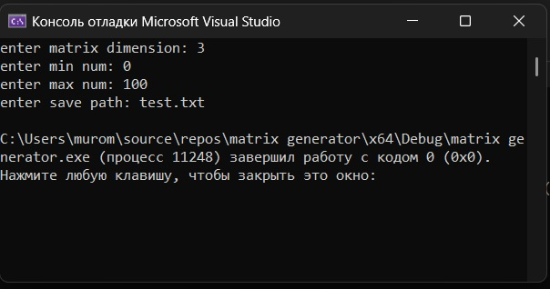
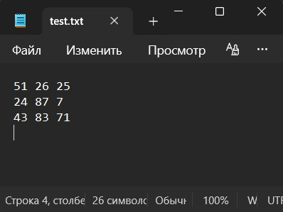

# Введение: Генератор квадратных матриц

## Автор

- **Студент:** Дубровин И.В.
- **Группа:** 6311
  
---
  

## Цель работы: Генерация матриц для тестов

Напишем простой генератор матриц на языке Си который спрашивает размер матрицы, минимальное и максимальное число, а также путь сохранения.

---

## Реализация

### main

спрашиваем необходимые данные, задаём зерно генерации и вызываем функцию генерации.

```cpp
int main() {
	int dim, min, max;
	char file_path[128];
	FILE* f;

	printf_s("enter matrix dimension: ");
	scanf_s("%d", &dim);
	printf_s("enter min num: ");
	scanf_s("%d", &min);
	printf_s("enter max num: ");
	scanf_s("%d", &max);
	printf_s("enter save path: ");
	scanf_s("%s", file_path, 128);

	fopen_s(&f, file_path, "w+");
	srand(time(NULL));

	gen_matrix(f, dim, min, (max - min) + 1);

	return 0;
}
```

### Генерация матриц

Матрицы генерируются случайным образом с использованием стандартного rand(), со стандартным методом корректировки диапозона.

```cpp
void gen_matrix(FILE* f, int dim, int min, int len) {
	for (int i = 0; i < dim; ++i) {
		for (int j = 0; j < dim; ++j) {
			fprintf_s(f, "%d ", rand() % len + min);
		}
		fseek(f, -1, SEEK_CUR);
		fprintf_s(f, "\n");
	}
}
```

## Результаты

### Пример работы:



## Файл с матрицей:



## Запуск

### Windows

1. Откройте коммандную строку разработчика и перейдите в директорию с .cpp файлом.
2. Скомпилируйте при помощи cl generator.cpp.
3. Запустите исполняемый файл в консоли при помощи .\generator.exe.
